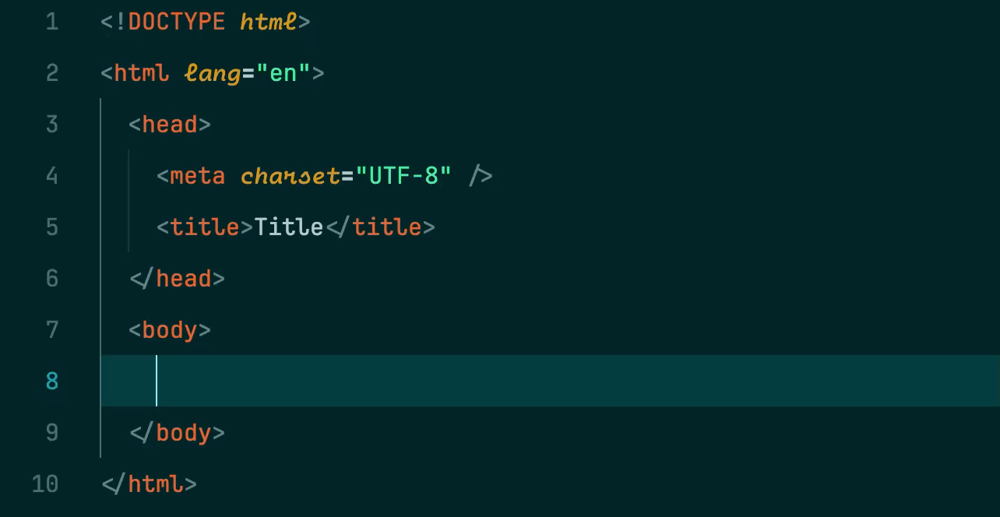

## HTML Self-Closing Tag Helper

<p align="center">
  
</p>
<p align="center">A VSCode extension that simplifies working with HTML self-closing tags.</p>

### Demo

| Before                       | After                        |
| ---------------------------- | ---------------------------- |
|  |  |
|  |  |

### Features

This extension provides two key features to make working with self-closing HTML tags smoother:

1. Auto-Convert Regular Tags to Self-Closing Tags

   When you add a slash to convert a regular HTML tag to a self-closing tag, the extension automatically removes the corresponding closing tag.

   ### Example:

   ```html
   <p></p>
   ```

   When you add a slash after the "p" to make it <p/, the extension automatically detects and removes the </p> closing tag:

   ```html
   <p/>
   ```

2. Auto-Complete Self-Closing Tag Syntax

   When typing a self-closing tag, the extension automatically adds the closing angle bracket.

   ### Example:

   ```html
   
   ```

### Supported Languages

- HTML
- XML
- PHP
- JavaScript (JSX)
- TypeScript (TSX)

### Installation

1. Open VSCode
2. Go to Extensions (Ctrl+Shift+X)
3. Search for "HTML Self-Closing Tag Helper"
4. Click Install

### Usage

The extension works automatically when editing supported file types. No configuration needed!

### Contributing

Contributions are welcome! Please feel free to submit a Pull Request.

1. Fork the repository
2. Create your feature branch (`git checkout -b feature/amazing-feature`)
3. Commit your changes (`git commit -m 'Add some amazing feature'`)
4. Push to the branch (`git push origin feature/amazing-feature`)
5. Open a Pull Request

### License

This project is licensed under the MIT License - see the LICENSE file for details.
